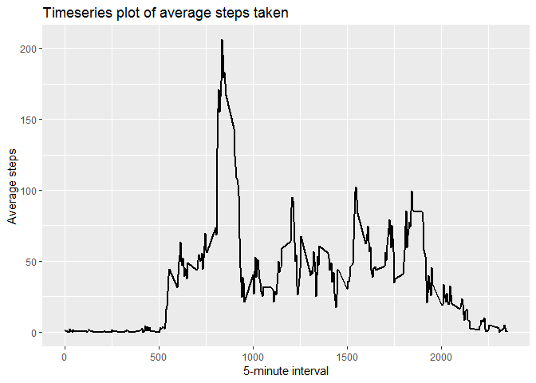

## Loading and preprocessing the data

Here are the packages I am using for this assignment:


```r
library(tidyverse)
```

```
## -- Attaching packages ------------------------------------------------------ tidyverse 1.2.1 --
```

```
## v ggplot2 3.1.0     v purrr   0.2.5
## v tibble  1.4.2     v dplyr   0.7.8
## v tidyr   0.8.2     v stringr 1.3.1
## v readr   1.3.1     v forcats 0.3.0
```

```
## -- Conflicts --------------------------------------------------------- tidyverse_conflicts() --
## x dplyr::filter() masks stats::filter()
## x dplyr::lag()    masks stats::lag()
```

```r
library(lubridate)
```

```
## 
## Attaching package: 'lubridate'
```

```
## The following object is masked from 'package:base':
## 
##     date
```

Here is my code to load the data: 


```r
setwd("C:/Users/207014104/Desktop/DataScience/Reproduceable Research/Project1/repdata_data_activity")

fileName <- "activity.csv"

#gitDataUrl <- "https://github.com/shkaht/RepData_PeerAssessment1/blob/master/activity.zip"

#read the csv once it has been unzipped in the working directory
activity <- as_tibble(read.csv(fileName))
```


## What is mean total number of steps taken per day?

1. Calculate the total number of steps taken per day


```r
dailySteps <- group_by(activity, date) %>%
        summarize(totalSteps = sum(steps))
print(dailySteps)
```

```
## # A tibble: 61 x 2
##    date       totalSteps
##    <fct>           <int>
##  1 2012-10-01         NA
##  2 2012-10-02        126
##  3 2012-10-03      11352
##  4 2012-10-04      12116
##  5 2012-10-05      13294
##  6 2012-10-06      15420
##  7 2012-10-07      11015
##  8 2012-10-08         NA
##  9 2012-10-09      12811
## 10 2012-10-10       9900
## # ... with 51 more rows
```

2. Make a histogram of the total number of steps taken each day


```r
ggplot(dailySteps, aes(x = totalSteps)) + 
        geom_histogram(binwidth = 2500, #set bins to width of 2500 steps
                       fill = "white", #make the fill of bars white
                       color = "black" #make outline of bars black
                       )
```

```
## Warning: Removed 8 rows containing non-finite values (stat_bin).
```

<!-- -->

3. Calculate and report the mean and median of the total number of steps taken per day


```r
meanOriginal <- mean(dailySteps$totalSteps, na.rm = TRUE)
medianOriginal <- median(dailySteps$totalSteps, na.rm = TRUE)

print(meanOriginal)
```

```
## [1] 10766.19
```

```r
print(medianOriginal)
```

```
## [1] 10765
```

## What is the average daily activity pattern?

1. Make a time series plot of the 5-minute interval and the average number of steps taken averaged across all days


```r
#group the data by interval and summarize by mean steps / interval
dailyProfile <- group_by(activity, interval) %>%
        summarize(intervalSteps = mean(steps, na.rm=TRUE))

# plot the 
ggplot(dailyProfile, aes(x = interval, y = intervalSteps)) + geom_line()
```

<!-- -->

2. Which 5-minute interval contains the maximum number of steps?


```r
dailyProfile[which.max(dailyProfile$intervalSteps),]
```

```
## # A tibble: 1 x 2
##   interval intervalSteps
##      <int>         <dbl>
## 1      835          206.
```

## Imputing missing values

1. Calculate and report the total missing values in the dataset


```r
#summarize the number of records in each column that are NAs
summary(is.na(activity))
```

```
##    steps            date          interval      
##  Mode :logical   Mode :logical   Mode :logical  
##  FALSE:15264     FALSE:17568     FALSE:17568    
##  TRUE :2304
```

```r
#calculate the number of NA rows by subtracting the complete cases from total number of rows
nrow(activity) - sum(complete.cases(activity))
```

```
## [1] 2304
```

```r
#what % of the total values for steps is NA
mean(is.na(activity$steps))
```

```
## [1] 0.1311475
```

2. Devise a strategy for filling in the missing values. 

My approach is to fill the mean value for the corresponding interval for each NA, using the summary data calculated above for dailyProfile

3. Create a new dataset that is equal to the original but with missing data filled in


```r
#join the data frame with mean values for each interval to the activity data
filled <- left_join(activity, dailyProfile, by = "interval")

#subset the na values and give it the value from the mean value interval column
filled$steps[is.na(filled$steps)] <- filled$intervalSteps[is.na(filled$steps)]

#remove the mean column so that the data is the same format as original
filled <- select(filled, -intervalSteps)

print(filled)
```

```
## # A tibble: 17,568 x 3
##     steps date       interval
##     <dbl> <fct>         <int>
##  1 1.72   2012-10-01        0
##  2 0.340  2012-10-01        5
##  3 0.132  2012-10-01       10
##  4 0.151  2012-10-01       15
##  5 0.0755 2012-10-01       20
##  6 2.09   2012-10-01       25
##  7 0.528  2012-10-01       30
##  8 0.868  2012-10-01       35
##  9 0      2012-10-01       40
## 10 1.47   2012-10-01       45
## # ... with 17,558 more rows
```

4. Make a histogram of the total number of steps taken each day with the filled NA data; and calculate the new mean and median


```r
dailySteps2 <- group_by(filled, date) %>%
        summarize(totalSteps = sum(steps))
print(dailySteps2)
```

```
## # A tibble: 61 x 2
##    date       totalSteps
##    <fct>           <dbl>
##  1 2012-10-01     10766.
##  2 2012-10-02       126 
##  3 2012-10-03     11352 
##  4 2012-10-04     12116 
##  5 2012-10-05     13294 
##  6 2012-10-06     15420 
##  7 2012-10-07     11015 
##  8 2012-10-08     10766.
##  9 2012-10-09     12811 
## 10 2012-10-10      9900 
## # ... with 51 more rows
```

```r
ggplot(dailySteps2, aes(x = totalSteps)) + 
        geom_histogram(binwidth = 2500, #set bins to width of 2500 steps
                       fill = "white", #make the fill of bars white
                       color = "black" #make outline of bars black
                       )
```

<!-- -->

```r
#mean & median, not removing NA's to confirm there are none
meanFilled <- mean(dailySteps2$totalSteps, na.rm = FALSE)
medianFilled <- median(dailySteps2$totalSteps, na.rm = FALSE)

print(meanFilled)
```

```
## [1] 10766.19
```

```r
print(medianFilled)
```

```
## [1] 10766.19
```
Do these values differ from the estimates from the first part of the assignment? What is the impact of imputing missing data on the estimates of the total daily number of steps?


```r
print(meanOriginal)
```

```
## [1] 10766.19
```

```r
print(medianOriginal)
```

```
## [1] 10765
```

You can see that the mean remains the same.  
The median, however is slightly higher and now equal to the mean. 

Imputing the missing data can contribute bias to the results as measurements are now counted as more than a single reading.  Any error in the mean values will be increased by weighting it more heavily. 

## Are there differences in activity patterns between weekdays and weekends?

Create a new factor variable in the dataset with 2 levels: "weekday" and "weekend"


```r
filled$date <- as_date(filled$date)

weekend <- c("Sat", "Sun")

filled <- mutate(filled, dayOfWeek = wday(date, label = TRUE)) %>%
        mutate(weekend = dayOfWeek %in% weekend)

filled$weekend <- factor(filled$weekend, 
                         levels = c(TRUE, FALSE), 
                         labels = c("weekend", "weekday")
                        )

print(filled)
```

```
## # A tibble: 17,568 x 5
##     steps date       interval dayOfWeek weekend
##     <dbl> <date>        <int> <ord>     <fct>  
##  1 1.72   2012-10-01        0 Mon       weekday
##  2 0.340  2012-10-01        5 Mon       weekday
##  3 0.132  2012-10-01       10 Mon       weekday
##  4 0.151  2012-10-01       15 Mon       weekday
##  5 0.0755 2012-10-01       20 Mon       weekday
##  6 2.09   2012-10-01       25 Mon       weekday
##  7 0.528  2012-10-01       30 Mon       weekday
##  8 0.868  2012-10-01       35 Mon       weekday
##  9 0      2012-10-01       40 Mon       weekday
## 10 1.47   2012-10-01       45 Mon       weekday
## # ... with 17,558 more rows
```

Make a panel plot containing a timeseries plot of the 5-min interval and the average number of steps taken for weekdays and weekends


```r
wkdayEnd <- group_by(filled, weekend, interval) %>%
        summarize(avg = mean(steps))

panel <- ggplot(wkdayEnd, aes(x = interval, y = avg)) + 
        facet_grid(weekend ~ .) + 
        geom_line()

plot(panel)
```

<!-- -->
